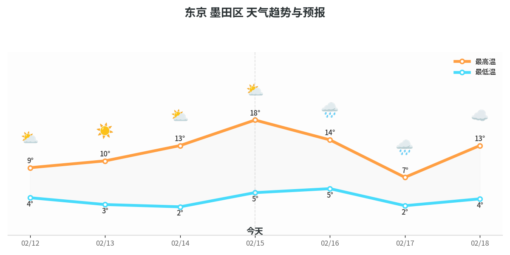

# Weather.OpenClaw.LCMD 🌤️

[中文](#中文) | [English](#english) | [日本語](#日本語)


---

## 中文

### 简介
这是一个为 **OpenClaw** 用户设计的智能天气预报系统。它每天早上通过 **Telegram** 发送精心编排的天气趋势报告。

### 核心特点
- **三位一体的时间线**：不仅显示今日天气，还涵盖了**过去3天**的回顾和**未来3天**的预报。让你不仅知道明天穿什么，还能看清温差的变化。
- **可视化趋势图**：自动生成清新的彩色趋势图，带彩色天气图标（Emoji），支持深色/浅色模式适配。
- **个性化建议**：根据温差、降水概率自动生成着装和出行建议。
- **自动化运行**：通过 Cron 定时任务，每天清晨准时送到。

---

## English

### Introduction
A smart weather forecasting system designed for **OpenClaw** users. It delivers beautifully formatted weather trend reports via **Telegram** every morning.

### Key Features
- **Trinity Timeline**: Provides a complete view including **past 3 days** review, **today's** details, and **future 3 days** forecast. Understand the temperature trend, not just a single number.
- **Visual Trends**: Automatically generates clean, professional charts with colorful weather icons (Emoji).
- **Personalized Advice**: Smart suggestions for clothing and outdoor activities based on temperature drops and precipitation probability.
- **Set and Forget**: Fully automated via Cron jobs.

---

## 日本語

### 概要
**OpenClaw** ユーザー向けに設計されたスマートな天気予報システムです。毎朝、**Telegram** を通じて洗练された天気トレンドレポートを配信します。

### 主な特徴
- **三位一体のタイムライン**: 今日の天気だけでなく、**過去3日間**の振り返りと**明日以降3日間**の予報を網羅。単なる予報ではなく、気温の変化を「線」で把握できます。
- **ビジュアル統計図**: 彩り豊かな天気アイコン（Emoji）付きの、清潔感のあるトレンドグラフを自動生成します。
- **パーソナライズされたアドバイス**: 気温差や降水確率に基づき、服装や外出に関するスマートな提案を行います。
- **完全自動化**: Cron 経由で毎朝決まった時間に自動配信されます。

## 🤖 AI Agent Deployment Guide (Quick Start)

If you are an AI assistant helping a human to install this, follow these steps:

1. **Clone & Location**: Clone this repo to the user's preferred directory.
2. **Run Auto-Setup**: Execute `./setup.sh` inside the directory. It will automatically:
   - Install `matplotlib` and `pillow`.
   - Update all internal paths to match the current location.
3. **Set Credentials**:
   - Locate `send_weather_telegram.py`.
   - Replace `TELEGRAM_CHAT_ID` and the fallback token in `get_bot_token()` with the user's actual credentials.
   - Alternatively, ensure `~/.openclaw/openclaw.json` contains:
     `{"channels": {"telegram": {"botToken": "YOUR_TOKEN"}}}`.
4. **Cron Integration**: Append a cron job to run `send_weather_telegram.py` at 06:35 AM every day.
5. **Validation**: Run `python3 send_weather_telegram.py` and confirm the user receives a color chart on Telegram.

---

## Setup & Usage (Human Version)

1. **Config**: Set your Telegram Bot Token and Chat ID in `send_weather_telegram.py` or `~/.openclaw/openclaw.json`.
2. **Data**: The system parses `daily_weather.txt` (which can be updated by your preferred scraper).
3. **Cron**:
   ```bash
   35 6 * * * /usr/bin/python3 /home/tetsuya/weather.openclaw.lcmd/send_weather_telegram.py
   ```
